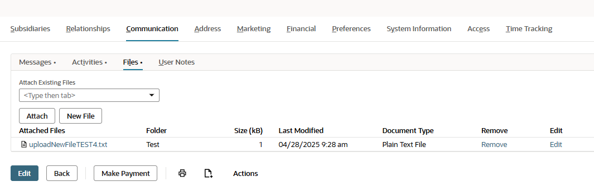

# Summary
This SuiteScript project uses a Restlet script to create a new file to be attached to vendor records after a purchase order is saved. Data to post to the newly created file will be defined in a client script.

# Key Concepts
This sample demonstrates the following concepts:

* **SuiteScript 2.1** – This SuiteScript version is the latest available version and includes new language features that are not part of SuiteScript 2.0. This sample uses some SuiteScript 2.1 features, such as arrow functions. For more information, see [SuiteScript 2.1](https://system.netsuite.com/app/help/helpcenter.nl?fid=chapter_156042690639.html).

* **Client script type** – Client scripts are scripts that are executed by predefined event triggers in the client browser. They can validate user-entered data and auto-populate fields or sublists at various form events. For more information, see [SuiteScript 2.x Client Script Type](https://docs.oracle.com/en/cloud/saas/netsuite/ns-online-help/section_4387798404.html).

* **Restlet script type** - A RESTlet is a SuiteScript that you make available for other applications to call. It can be called from either an external application or from another script within NetSuite. A RESTlet executes only when it is called and in some cases, returns a value to the calling application.

RESTlets can be useful when you want to bring data into NetSuite from another system, or if you want to extract data from NetSuite. RESTlets can also be used in combination with other scripts to customize the behavior of a page within NetSuite. For more information, see [SuiteScript 2.x RESTlet Script Type](https://docs.oracle.com/en/cloud/saas/netsuite/ns-online-help/section_4387799403.html).

# SuiteScript Version
This sample uses SuiteScript 2.1. For more information about this SuiteScript version, see [SuiteScript 2.1](https://system.netsuite.com/app/help/helpcenter.nl?fid=chapter_156042690639.html).

# Loaded Modules
This sample loads and uses the following SuiteScript modules:

* **N/https** – To communicate between SuiteScript scripts and RESTlets. For more information, see [N/https](https://docs.oracle.com/en/cloud/saas/netsuite/ns-online-help/section_4418229131.html).
* **N/url** - To determine URL navigation paths within NetSuite and format URL strings. For more information, see [N/url](https://docs.oracle.com/en/cloud/saas/netsuite/ns-online-help/section_4358552918.html).
* **N/file** - To work with files within NetSuite. You can use this module to upload files to the NetSuite File Cabinet, as well as send files as attachments without uploading them to the File Cabinet. For more information, see [N/file Module](https://docs.oracle.com/en/cloud/saas/netsuite/ns-online-help/section_4205693274.html).
* **N/record** - To work with NetSuite records. You can use this module to create, delete, copy, load, or make changes to a record. For more information, see [N/record Module](https://docs.oracle.com/en/cloud/saas/netsuite/ns-online-help/section_4267255811.html).
* **N/log** – To log errors that occur during execution. For more information, see [N/log Module](https://system.netsuite.com/app/help/helpcenter.nl?fid=section_4574548135.html).

# Script Type and Entry Points
This sample uses a user event script type with the following entry points:

* `post` – Defines the function that is executed when a post request is sent to a RESTlet. Typically used for posting, such as creating a NetSuite record.
* `saveRecord` - 	
  Defines the function that is executed when a record is saved (after the submit button is pressed but before the form is submitted).

# Test the Solution
1. Go to Transactions > Purchases > Enter Purchase Orders.
2. Fill out the required fields for the purchase order.
3. Click Save.

When the record is saved, a new file will be created and attached to the vendor record of the purchase order. To view the attached file on the vendor record:

1. Go to Lists > Relationships > Vendors.
2. Click View on the vendor record used on the purchase order.
3. Click the Communication tab.
4. Under the Files subtab, confirm the file was attached to the record.

## [License](./LICENSE.txt)
Copyright (c) 2021 Oracle and/or its affiliates The Universal Permissive License (UPL), Version 1.0.
