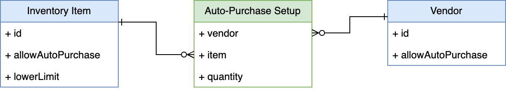

# About the example

Example is defined in order to show-case the combination of Custom records & fields storing the configuration
of custom automated process (Auto-purchasing) that is implemented via Map/Reduce script.

The configuration of Custom records in example is demonstrating how to effectively use "Is Parent" property
of a Custom List/Record fields to utilize Custom record types as sublists on standard record types
(in this case Vendor and Inventory Item).

## Scenario description

- Inventory Items and Vendors can be configured for auto-purchasing.
  - Able to configure from both Item and Vendor.
- Automatic purchase happens when Item stock count is below configured limit.
- Automatic purchase must not happen when Item has pending Purchase Orders.
> Note: In order to run automatic purchases, Auto-Purchase Setup instances must be initiated/created by end user first (need to be defined by user manually).



# Limitations

- Example is not considering *Units of Measure* feature, and works with plain quantities only.

# Potential improvements

- Allowing inactivation of existing configuration itself - via Custom record type configuration.
- Performing inactivation (or removal), of existing configurations associated with Vendor/Item , when Vendor/Item is unset as "Allow Automatic Purchase" (e.g. via Vendor/Item UEs).

# Folder structure

- ./Custom Entity Fields/ - xml definitions of Custom Entity Fields needed for this example
- ./Custom Item Fields/ - xml definitions of Custom Item Fields needed for this example
- ./Custom Records/ - xml definitions of Custom Record Types needed for this example
- ./Scripts/ - Client and Map/Reduce scripts for this example

# Configuration of custom records and fields

## Custom Record Type: Auto-Purchase Setup

For manual creation, please go to *Customization -> Lists, Records & Fields -> Record Types -> New*.

Configuration record type for describing relationship and properties of auto-purchasing Items from Vendors.
Demonstrates Record is Parent concept, which allows generation of sublist of this record type on Items and Vendors
and allows to perform its setup directly from these records.

Note that in order to position Auto-Purchase Setup sublist on Vendor and Item (set via *Display: Parent Subtab*),
Custom Subtabs must be added first to Entity and Item record type families.

*Customization -> Forms -> Subtabs -> New*
- for Vendor:
  - **Script ID:** custtab_vend_autopurch_tab
  - **Type:** Entity
  - **Title:** Automatic Purchase
- for Item:
  - **Script ID:** custtab_ii_autopurch_tab
  - **Type:** Item
  - **Title:** Automatic Purchase

### Record Type properties
**Body fields:**
- **Name:** Auto-Purchase Setup
- **ID:** customrecord_autopurchase

Field defaults are fine for this example.

## Custom Fields on Auto-Purchase Setup

Note that in order to create Custom Fields for the Custom Record Type, it must be saved first.

### Vendor field

**Body fields:**
- **Label:** Vendor
- **ID:** custrecord_autopurch_vendor
- **Type:** List/Record
- **List/Record:** Vendor
- **Record is Parent:** Yes !!!
- **Show in List:** Yes
- **Store Value:** Yes

**Tabs:**
- **Display:**
  - **Parent Subtab:** Automatic Purchase
- **Validation & Defaulting:**
  - **Mandatory:** Yes
- **Sourcing & Filtering:**
  - **[0]:**
    - **Filter Using:** Allow Automatic Purchase
    - **Is Checked:** Yes

### Item field

**Body fields:**
- **Label:** Item
- **ID:** custrecord_autopurch_item
- **Type:** List/Record
- **List/Record:** Item
- **Record is Parent:** Yes !!!
- **Show in List:** Yes
- **Store Value:** Yes

**Tabs:**
- **Display:**
  - **Parent Subtab:** Automatic Purchase
- **Validation & Defaulting:**
  - **Mandatory:** Yes
- **Sourcing & Filtering:**
  - **[0]:**
    - **Filter Using:** Type
    - **Compare Type:** equal
    - **Value Is:** Inventory Item
  - **[1]:**
    - **Filter Using:** Allow Automatic Purchase
    - **Is Checked:** Yes

### Quantity field

**Body fields:**
- **Label:** Quantity
- **ID:** custrecord_autopurch_quantity
- **Type:** Decimal Number
- **Show in List:** Yes
- **Store Value:** Yes
- **Description:** When automatic reorder happens, quantity specified in this field will be the one appearing on automatically created Purchase Order for given Item-Vendor relationship.

**Tabs:**
- **Display:**
  - **Apply Formatting:** Yes
- **Validation & Defaulting:**
  - **Mandatory:** Yes

## Custom Entity Field: Allow Automatic Purchase

For manual creation, please go to *Customization -> Lists, Records & Fields -> Entity Fields -> New*.

**Body fields**
- **Label:** Allow Automatic Purchase
- **ID:** custentity_vendor_autopurchase
- **Type:** Check Box
- **Store Value:** Yes
- **Description:** When checked, this Vendor is allowed to be configured for auto-purchasing feature.

**Tabs**
- **Applies To:**
  - **Vendor:** Yes
- **Display:**
  - **Subtab:** Automatic Purchase

## Custom Item Field: Allow Automatic Purchase

For manual creation, please go to *Customization -> Lists, Records & Fields -> Item Fields -> New*.

**Body fields**
- **Label:** Allow Automatic Purchase
- **ID:** custitem_ii_autopurchase
- **Type:** Check Box
- **Store Value:** Yes
- **Description:** When checked, this Inventory Item is allowed to be configured for auto-purchasing feature.

**Tabs**
- **Applies To:**
  - **Inventory Item:** Yes
  - **Subtype:** Purchase
- **Display:**
  - **Subtab:** Automatic Purchase

## Custom Item Field: Auto-purchase When Below

**Body fields**
- **Label:** Auto-purchase When Below
- **ID:** custitem_ii_lowerlimit
- **Type:** Decimal Number
- **Store Value:** Yes
- **Description:** When Allow Automatic Purchase field is checked, value of this field should be filled. When Quantity on Hand gets below the number set in this field, item will be considered for automatic re-order.

**Tabs**
- **Applies To:**
  - **Inventory Item:** Yes
  - **Subtype:** Purchase
- **Display:**
  - **Subtab:** Automatic Purchase
- **Validation & Defaulting:**
  - **Minimum Value:** 0

# About Scripts

## inventoryItem-clientScripts.js

Simple client script example for Inventory Item record type, showcasing client-side conditional configuration of mandatory field.
Mandatory property of custom field is evaluated as part of *pageInit* and *fieldChanged* handlers.

**Deployment aspects:**
- **Applies to:** Inventory Part

## automatic-purchasing-mapReduce.js

Example of Map/Reduce script which utilizes:
- *N/query* module to load relevant vendor-item setup for auto-purchasing - demonstrates how to combine queries between custom and standard records in order to achieve the goals.
- *N/record* module to create purchase orders

This Map/Reduce script is utilizing the Shuffle stage, to efficiently group multiple Items associated with the same Vendor,
so that in Reduce step only single Purchase Order per Vendor is created.

### SuiteQL used

``` sql
SELECT
    setup.custrecord_autopurch_vendor AS vendor,
    setup.custrecord_autopurch_item AS item,
    setup.custrecord_autopurch_quantity quantity 
FROM customrecord_autopurchase setup 
    INNER JOIN item item ON setup.custrecord_autopurch_item = item.id 
WHERE nvl(item.totalQuantityOnHand, 0.0) <= setup.custrecord_autopurch_quantity 
    AND NOT EXISTS(
        SELECT 1 FROM TransactionLine tl, Transaction t
            WHERE t.id = tl.transaction 
            AND t.type = 'PurchOrd' 
            AND t.status IN ('PurchOrd:A', 'PurchOrd:B', 'PurchOrd:D', 'PurchOrd:E', 'PurchOrd:F', 'PurchOrd:G') 
            AND tl.item = setup.custrecord_autopurch_item
            AND t.entity = setup.custrecord_autopurch_vendor
        )
```