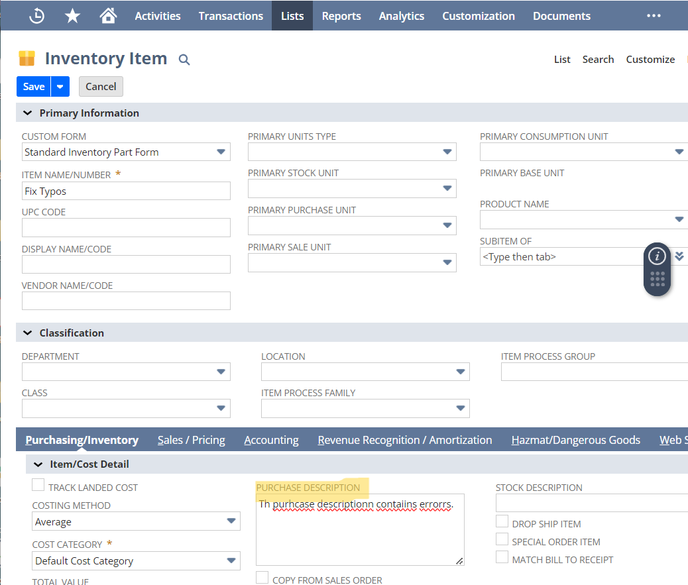

# Summary
This SuiteScript project corrects text typos on the purchase description and sales description fields for inventory item records. This project uses the N/llm Module that is used to send requests to the large language model and receive responses.

# Key Concepts
This sample demonstrates the following concepts:

* **SuiteScript 2.1** – This SuiteScript version is the latest available version and includes new language features that are not part of SuiteScript 2.0. This sample uses some SuiteScript 2.1 features, such as arrow functions. For more information, see [SuiteScript 2.1](https://system.netsuite.com/app/help/helpcenter.nl?fid=chapter_156042690639.html).

* **User Event script type** – This script type is used to perform certain actions on records, such as create, load, update, copy, delete, or submit. Most standard NetSuite records and custom record types support user event scripts. Exceptions include records used for personal identification purposes (such as a Driver’s License, Passport, or other Government-issued ID), some revenue recognition records, and some timecard-related records.

* **Promise Object** – A promise is a JavaScript object that represents the eventual result of an asynchronous process. After the promise object is created, it serves as a placeholder for the future success or failure of the asynchronous process. While the promise object is waiting, the remaining segments of the script can execute. With promises, developers can write asynchronous code that is intuitive and efficient. For more information, see [Promise Object](https://docs.oracle.com/en/cloud/saas/netsuite/ns-online-help/section_4387812940.html).

# SuiteScript Version
This sample uses SuiteScript 2.1. For more information about this SuiteScript version, see [SuiteScript 2.1](https://system.netsuite.com/app/help/helpcenter.nl?fid=chapter_156042690639.html).

# Loaded Modules
This sample loads and uses the following SuiteScript modules:

* **N/record** – To load and work with records. For more information, see [N/record Module](https://system.netsuite.com/app/help/helpcenter.nl?fid=section_4267255811.html).
* **N/llm** – Use the SuiteScript Generative AI N/llm module to send requests to the large language model (LLM) and to receive responses from it. NetSuite accesses the LLM through an integration with the [OCI Generative AI service](https://docs.oracle.com/en-us/iaas/Content/generative-ai/home.htm). For more information, see [N/llm Module](https://docs.oracle.com/en/cloud/saas/netsuite/ns-online-help/article_9123730083.html).

# Script Type and Entry Points
This sample uses a user event script type with the following entry points: 

* `beforeSubmit` – Defines the function that is executed before a record is submitted; that is, prior to any write operation on the record. For more information, see [beforeSubmit(context)](https://docs.oracle.com/en/cloud/saas/netsuite/ns-online-help/section_4407992070.html).

# Test the Solution
1. Go to Lists > Accounting > Items > New and select Inventory Item.
2. On the Inventory Item page, provide a text value with typos for the purchase description and sales description fields. Fill out any additional required or optional fields on the form.
3. Click save.
4. Verify the typos in the purchase description and sales description field are fixed.

Before the record is saved:

After the record is saved:

## [License](./LICENSE.txt)
Copyright (c) 2024 Oracle and/or its affiliates The Universal Permissive License (UPL), Version 1.0.
