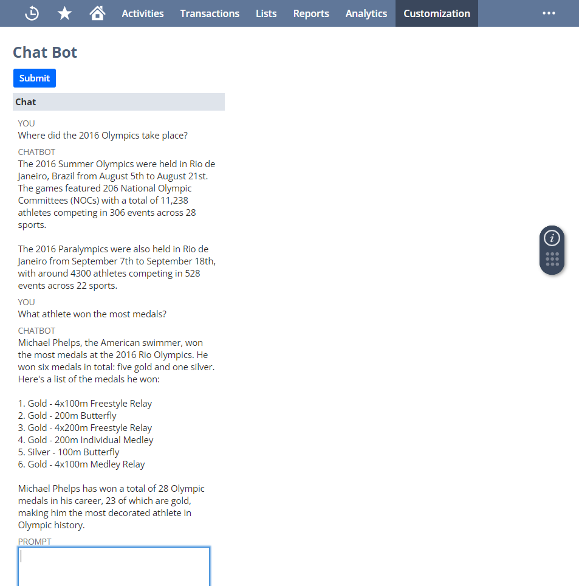

# Summary
This SuiteScript project creates a chatbot on a Suitelet form. This project uses the N/llm Module that is used to send requests to the large language model and receive responses. This script uses the N/ui/serverWidget Module to create a NetSuite form to send and receive requests from the LLM. The requests and responses are saved and displayed on a serverwidget field. A submit button is created to submit user input. 

# Key Concepts
This sample demonstrates the following concepts:

* **SuiteScript 2.1** – This SuiteScript version is the latest available version and includes new language features that are not part of SuiteScript 2.0. This sample uses some SuiteScript 2.1 features, such as arrow functions. For more information, see [SuiteScript 2.1](https://docs.oracle.com/en/cloud/saas/netsuite/ns-online-help/chapter_156042690639.html).

* **Suitelet script type** – Suitelets are extensions of the SuiteScript API that allow you to build custom NetSuite pages and backend logic. Suitelets are server scripts that operate in a request-response model, and are invoked by HTTP GET or POST requests to system generated URLs. For more information, see [SuiteScript 2.x Suitelet Script Type](https://docs.oracle.com/en/cloud/saas/netsuite/ns-online-help/section_4387799600.html).

# SuiteScript Version
This sample uses SuiteScript 2.1. For more information about this SuiteScript version, see [SuiteScript 2.1](https://docs.oracle.com/en/cloud/saas/netsuite/ns-online-help/chapter_156042690639.html).

# Loaded Modules
This sample loads and uses the following SuiteScript modules:

* **N/ui/serverWidget** – Use the N/ui/serverWidget module to work with the user interface within NetSuite. You can use Suitelets to build custom pages and wizards that have a NetSuite look-and-feel. You can also create various components of the NetSuite UI (for example, forms, fields, sublists, tabs). For more information, see [N/ui/serverWidget Module](https://docs.oracle.com/en/cloud/saas/netsuite/ns-online-help/section_4321345532.html).
* **N/llm** – Use the SuiteScript Generative AI N/llm module to send requests to the large language model (LLM) and to receive responses from it. NetSuite accesses the LLM through an integration with the [OCI Generative AI service](https://docs.oracle.com/en-us/iaas/Content/generative-ai/home.htm). For more information, see [N/llm Module](https://docs.oracle.com/en/cloud/saas/netsuite/ns-online-help/article_9123730083.html).

# Script Type and Entry Points
This sample uses a user event script type with the following entry points: 

* `onRequest` – Defines the function that is executed before a record is submitted; that is, prior to any write operation on the record. For more information, see [onRequest(params)](https://docs.oracle.com/en/cloud/saas/netsuite/ns-online-help/section_4407987288.html).

# Test the Solution
1. Go to Customization > Scripting > Script Deployments.
2. Click View next to the chatbot Suitelet script deployment.
3. Click the link under URL to access the Suitelet.

## [License](./LICENSE.txt)
Copyright (c) 2024 Oracle and/or its affiliates The Universal Permissive License (UPL), Version 1.0.
